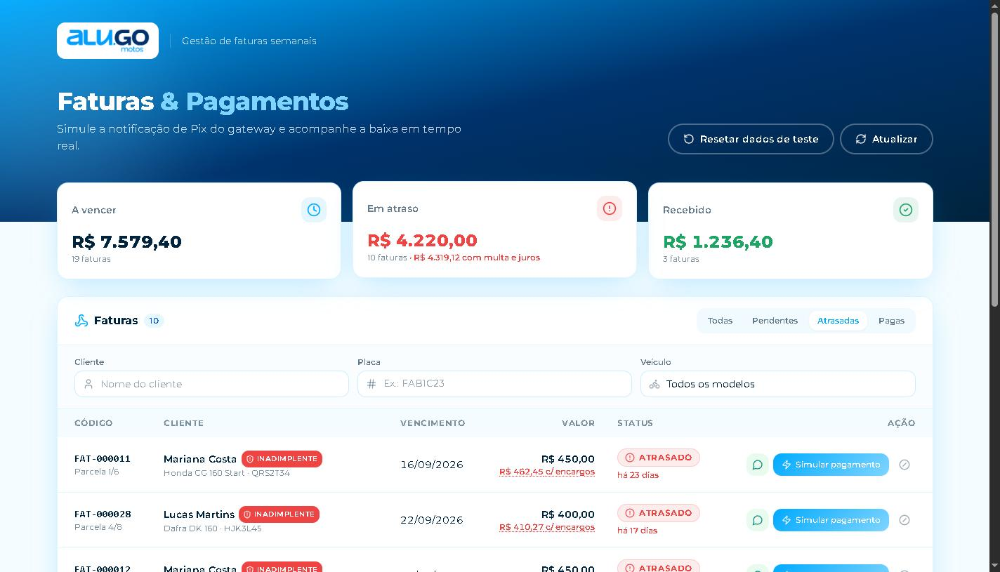

# Mini-Locação com Webhook — Desafio AluWare

[](https://github.com/lucasfranca46/aluware-mini-locacao/actions/workflows/ci.yml)

Rotina de locação de motos: o **banco gera as faturas semanais** ao ativar um contrato, e um **webhook idempotente** liquida a fatura quando o Pix é confirmado, gravando a baixa no fuso de Brasília.

**🔗 [aluware-mini-locacao.vercel.app](https://aluware-mini-locacao.vercel.app)** · Webhook: `POST https://uujgutwvdmbxrtzqprwh.supabase.co/functions/v1/webhook-pagamento`



📄 **[Apresentação do sistema para o cliente](docs/APRESENTACAO.md)**: objetivo, funcionalidades, valor para o negócio e próximos passos.

## Resumo para quem avalia

### Como testar em 2 minutos (no site)

1. **Simular pagamento** numa fatura **em dia**: a linha vira *Pago* na hora, com o horário de Brasília.
2. **Simular pagamento** numa fatura **atrasada**: o valor enviado já inclui multa e juros (ex.: R$ 400,00 → R$ 409,87), e a fatura fica marcada "Pago com N dias de atraso".
3. **Reenviar webhook** na fatura paga: responde **200** "já estava paga" e não duplica nada (**idempotência**).
4. **⊘** em qualquer fatura em aberto: simula um Pix com valor errado e recebe **422** (valor divergente). A fatura continua em aberto.
5. **Resetar dados de teste** (no topo): recria o cenário para testar de novo.

A linha pequena e cinza nas notificações (`HTTP 200 · idempotente`) existe para facilitar a avaliação. [Por que ela aparece](#mensagens-técnicas-na-tela-decisão-consciente).

### O que o desafio pedia

| Requisito | Onde | |
|---|---|---|
| Tabelas `clientes`, `veiculos`, `contratos`, `faturas` | [migration inicial](supabase/migrations/20261009000000_mini_locacao.sql) | ✅ |
| Contrato `ativo` gera as faturas semanais por **trigger** | `trg_contratos_gerar_faturas` | ✅ |
| Fatura paga não pode ser cancelada nem mudar de valor | `trg_faturas_proteger_paga` + constraint | ✅ |
| Webhook `{ fatura_id, valor_pago, evento }` em TypeScript | [Edge Function](supabase/functions/webhook-pagamento) | ✅ |
| Valor recebido precisa coincidir com o da fatura | `liquidar_fatura` → **422** se divergir | ✅ |
| Baixa atômica com data/hora em `America/Sao_Paulo` | `SELECT … FOR UPDATE` + `pago_em_brt` | ✅ |
| **Idempotência**: reenvio responde 200 sem duplicar | testado inclusive com 5 envios **simultâneos** | ✅ |
| Tela com Código, Cliente, Vencimento, Valor e Status (Pendente/Pago/Atrasado) | React + TS + Tailwind | ✅ |
| Botão "Simular Notificação de Pagamento" com feedback imediato | linha atualiza na hora + notificação | ✅ |
| README + deploy (Supabase + Vercel) | este arquivo + links acima | ✅ |

### O que foi além

| Extra | Por quê |
|---|---|
| **Multa 2% + juros 1% a.m.**: fatura atrasada é paga com encargos, calculados no banco por uma única função | Regra financeira real, sem divergência entre tela e banco |
| **Gestão de atraso**: dias em atraso, selo *Inadimplente*, cobrança no **WhatsApp** com mensagem pronta, "Pago com N dias de atraso" | É o problema do dia a dia de uma locadora |
| **Formato Asaas** no mesmo webhook, com token `asaas-access-token` obrigatório | Pronto para um gateway real |
| **Leitura pública mínima**: a chave pública não lê CPF, e-mail nem telefone | LGPD |
| **Filtros** por cliente, placa e veículo; aba *Pagas* do mais recente para o mais antigo | Uso real da tela |
| **Botão de reset** dos dados de demonstração (limite de 1 a cada 30 s) | O avaliador sempre encontra o que testar |
| **30 testes** contra um Postgres real (PGlite) + **CI** no GitHub Actions | Regras garantidas por teste, não só por leitura |
| Identidade visual da **Alu.GO** (logo, cores e fonte do site oficial) | Cara de produto do cliente |

| Camada | Stack | Onde |
|---|---|---|
| Banco | PostgreSQL (Supabase): tabelas, triggers, constraints, funções | [`supabase/migrations/`](supabase/migrations) |
| Backend | Supabase Edge Function (Deno + TypeScript) | [`supabase/functions/webhook-pagamento/`](supabase/functions/webhook-pagamento) |
| Frontend | React + TypeScript + Tailwind (Vite) | [`web/`](web) |
| Testes | `node:test` + PGlite (Postgres real em WASM) | [`tests/`](tests) |

---

## Rodando localmente

### 1. Só o frontend (modo demonstração — 1 minuto)

Sem nenhuma configuração, a tela roda com dados em memória que reproduzem as mesmas regras do banco:

```bash
cd web
npm install
npm run dev          # http://localhost:8080
```

### 2. Testes do banco e do webhook (sem Docker)

Os testes sobem um PostgreSQL real em memória (PGlite), aplicam as migrations + seed e exercitam triggers, constraints, permissões e o handler HTTP do webhook.

> **Requer Node 22.18 ou mais recente** (versão em `.nvmrc`). Os testes importam o `handler.ts` direto, e só a partir dessa versão o Node executa TypeScript sem etapa de build. Com nvm: `nvm use`.

```bash
npm install
npm test
```

```
✔ contrato ativo de R$ 400 x 4 semanas gera 4 faturas semanais
✔ contrato rascunho não gera faturas; ao ativar, gera uma única vez
✔ liquidação grava pago + data/hora no fuso de Brasília
✔ webhook repetido é idempotente: não altera a baixa original
✔ valor divergente não liquida
✔ fatura inexistente e fatura cancelada
✔ fatura paga não pode ser cancelada, alterada ou excluída
✔ fatura pendente pode ser cancelada e ter valor ajustado
✔ constraint impede marcar como pago sem dados de baixa
✔ view deriva status atrasado e seed tem cenários variados
✔ veículo não pode ter dois contratos ativos
✔ papel anon (chave pública do site) lê a vw_faturas, mas não CPF/e-mail/telefone
✔ vw_faturas expõe modelo e placa separados (filtros da tela)
✔ encargos de atraso: multa 2% + juros 1% a.m. pro rata, só para faturas atrasadas
✔ fatura paga não gera encargos, mesmo vencida
✔ resetar_demo recria o cenário, inclusive faturas pagas, e limita a 1 reset a cada 30 s
✔ fatura atrasada só é liquidada com multa + juros, gravados separadamente
✔ fatura em dia (ou vencendo hoje) é paga sem encargos
✔ PAYMENT_RECEIVED com valor correto liquida (200)
✔ reenvio do mesmo webhook (inclusive em paralelo) responde 200 sem duplicar baixa
✔ valor divergente -> 422 e fatura continua pendente
✔ fatura inexistente -> 404
✔ payload inválido -> 400
✔ outros eventos são ignorados com 200
✔ simulação (formato do desafio) não exige token, mesmo com WEBHOOK_TOKEN configurado
✔ Asaas: token é obrigatório e precisa estar configurado
✔ Asaas: PAYMENT_RECEIVED com token certo liquida pela externalReference
✔ Asaas: reenvio é idempotente e PAYMENT_CONFIRMED também conta como pago
✔ Asaas: recusa definitiva responde 200 (sem reenvio) e não liquida
✔ Asaas: outros eventos são ignorados e payload sem externalReference é 400
ℹ tests 30 · pass 30 · fail 0
```

### 3. Stack completa com Supabase

**Opção A — projeto na nuvem (não precisa de Docker)**

```bash
npx supabase login
npx supabase link --project-ref <SEU_PROJECT_REF>
npx supabase db push --include-seed            # migration + seed
npx supabase secrets set WEBHOOK_TOKEN=<um-segredo>   # só para receber o formato Asaas
npx supabase functions deploy webhook-pagamento --no-verify-jwt
```

**Opção B — Supabase local (requer Docker)**

```bash
npx supabase start          # aplica migration + seed automaticamente
npx supabase functions serve webhook-pagamento --no-verify-jwt
```

Depois, configure o frontend:

```bash
cd web
cp .env.example .env        # preencha VITE_SUPABASE_URL e VITE_SUPABASE_ANON_KEY
npm run dev
```

**Deploy do frontend (Vercel/Netlify):** root directory `web`, build `npm run build`, output `dist`, e as mesmas variáveis `VITE_*`.

### Testando o webhook via cURL

O valor enviado precisa ser o **valor devido no dia**: o valor da parcela se ela estiver em dia, ou valor + multa + juros se estiver atrasada. Pegue a fatura e o valor certo na view (SQL Editor do Supabase):

```sql
select id, codigo, status, valor_atualizado
  from vw_faturas
 where status in ('pendente', 'atrasado')
 order by vencimento;
```

**Formato do desafio (simulação):**

```bash
curl -i -X POST "$SUPABASE_URL/functions/v1/webhook-pagamento" \
  -H "Content-Type: application/json" \
  -d '{"fatura_id":"<id>","valor_pago":<valor_atualizado>,"evento":"PAYMENT_RECEIVED"}'
```

Rode duas vezes: a primeira retorna `"resultado":"liquidada"`, a segunda `"resultado":"ja_processada"`. As duas retornam **200**. Com outro valor (por exemplo, o valor original de uma fatura atrasada), a resposta é **422** `valor_divergente`, com o `valor_esperado` no corpo.

**Formato Asaas (como o gateway real envia):**

```bash
curl -i -X POST "$SUPABASE_URL/functions/v1/webhook-pagamento" \
  -H "Content-Type: application/json" \
  -H "asaas-access-token: $WEBHOOK_TOKEN" \
  -d '{"event":"PAYMENT_RECEIVED","payment":{"id":"pay_123","value":<valor_atualizado>,"billingType":"PIX","externalReference":"<id>"}}'
```

Sem o header, ou com o token errado, a resposta é **401**. Se o `WEBHOOK_TOKEN` não estiver configurado na função, é **503**.

---

## Decisões técnicas

### Banco de dados

- **Geração de faturas por trigger** (`trg_contratos_gerar_faturas`, `AFTER INSERT OR UPDATE OF status`). Contrato inserido como `ativo` (ou que muda de `rascunho` para `ativo`) gera `qtd_semanas` faturas com `generate_series`. A parcela *N* vence em `data_inicio + 7·N` dias. A geração não duplica porque o trigger checa se já existem faturas e porque há `UNIQUE (contrato_id, parcela)`.
- **Fatura paga é imutável** (`trg_faturas_proteger_paga`, `BEFORE UPDATE OR DELETE`). Bloqueia cancelamento, volta para pendente, mudança de valor, de vencimento ou dos dados de baixa, e exclusão. Isso é garantido no banco, então vale para qualquer cliente: API, painel SQL ou outro serviço.
- **Constraint `faturas_baixa_consistente`**: `status = 'pago'` exige `pago_em`, `pago_em_brt` e `valor_pago = valor`. Não existe "pago pela metade" nem "pago sem data".
- **Dinheiro em `numeric(12,2)`**, nunca `float`.
- **Fuso de Brasília**: `pago_em` é `timestamptz` (o instante absoluto, que é o correto para comparar e ordenar). `pago_em_brt` guarda o mesmo instante como relógio de parede de `America/Sao_Paulo`, conforme o requisito, e já vem pronto para relatórios e conciliação. O frontend também formata com `timeZone: 'America/Sao_Paulo'`, independente do fuso de quem acessa.
- **`atrasado` é derivado, não persistido**: a view `vw_faturas` calcula `pendente + vencimento < hoje (BRT)`. Isso dispensa cron job para "virar" status e evita fatura marcada como atrasada que já foi paga.
- **Extras**: um veículo não pode ter dois contratos ativos (índice único parcial), validação de CPF e placa Mercosul, e RLS habilitado com escrita apenas via `service_role`.
- **Leitura pública mínima** ([`20261009000100_restringir_leitura_publica.sql`](supabase/migrations/20261009000100_restringir_leitura_publica.sql)): a anon key vai no JavaScript do site, então tudo que o papel `anon` lê é público na prática. Por isso ele só tem privilégio nas **colunas** que a `vw_faturas` usa. CPF, e-mail e telefone não são acessíveis pela API, e um teste garante isso. A view segue com `security_invoker = true`, sem recorrer a uma view *security definer*.

### Webhook: atomicidade e idempotência

Toda a regra crítica fica em **uma função no banco**, `liquidar_fatura(fatura_id, valor_pago)`, executada numa única transação:

1. `SELECT ... FOR UPDATE` trava a linha da fatura. Se o gateway disparar o mesmo webhook duas vezes **ao mesmo tempo**, o segundo espera o primeiro commitar.
2. Se a fatura já está `pago`, retorna `ja_processada` sem alterar nada e o endpoint responde **200** (o gateway para de reenviar).
3. Calcula o **valor devido no dia** com a mesma função usada pela tela (`calcular_encargos`): o valor da parcela se estiver em dia, ou valor + multa + juros se estiver atrasada. Se o valor recebido não bate (comparação em centavos), retorna `valor_divergente` com o `valor_esperado`, e o endpoint responde **422**. A fatura continua em aberto.
4. Caso contrário, faz `UPDATE` de status, `valor_pago`, `multa_paga`, `juros_pago`, `pago_em` e `pago_em_brt` de uma vez. A constraint garante `valor_pago = valor + multa_paga + juros_pago`.

A Edge Function só faz validação de entrada, autenticação e o mapeamento resultado → HTTP.

#### Dois formatos na mesma URL

| | Simulação (formato do desafio) | Asaas (gateway real) |
|---|---|---|
| Payload | `{ fatura_id, valor_pago, evento }` | `{ event, payment: { id, value, externalReference } }` |
| Quem chama | botão "Simular pagamento" do site | servidor do Asaas |
| Como acha a fatura | `fatura_id` | `payment.externalReference` (a cobrança é criada no Asaas com o id da fatura) |
| Eventos que dão baixa | `PAYMENT_RECEIVED` | `PAYMENT_RECEIVED` (Pix) e `PAYMENT_CONFIRMED` (cartão) |
| Token `asaas-access-token` | não exige | **obrigatório** |

As duas entradas passam pela mesma `liquidar_fatura`, então as garantias de idempotência, atomicidade e fuso são idênticas.

**Por que a simulação não exige token:** ela é chamada pelo navegador. Um token embutido no frontend vai parar no JavaScript público, e qualquer pessoa conseguiria copiá-lo. O token só protege de verdade quando fica guardado no servidor de quem chama, que é o caso do Asaas. Num sistema em produção, a rota de simulação não existiria.

#### Respostas HTTP

| Situação | Simulação | Asaas |
|---|---|---|
| Liquidada / já processada (reenvio) | 200 | 200 |
| Evento que não é de pagamento | 200 (ignorado) | 200 (ignorado) |
| Payload inválido | 400 | 400 |
| Token ausente ou errado | — | 401 |
| `WEBHOOK_TOKEN` não configurado | — | 503 |
| Fatura não encontrada | 404 | 200 + `"resultado":"nao_encontrada"` |
| Fatura cancelada | 409 | 200 + `"resultado":"cancelada"` |
| Valor divergente | 422 | 200 + `"resultado":"valor_divergente"` |
| Erro inesperado | 500 | 500 (o gateway reenvia, o que é seguro porque a operação é idempotente) |

**Por que o Asaas recebe 200 nas recusas:** o Asaas reenvia todo webhook que não recebe 200 e, depois de várias falhas seguidas, pausa a fila de envios. Valor divergente, fatura inexistente ou fatura cancelada não se resolvem com reenvio. Então a resposta é 200, a fatura **não** é liquidada, o motivo vai no corpo e o caso fica registrado no log para conciliação. Só erro inesperado (500) provoca reenvio.

A função roda com `verify_jwt = false` porque o gateway não tem JWT do Supabase. A autenticação do Asaas é feita pelo header `asaas-access-token`, com comparação em tempo constante.

A lógica HTTP fica em `handler.ts`, sem dependências de runtime, e por isso os testes conseguem rodá-la em Node contra o Postgres real.

### Frontend

- Visual alinhado à identidade da Alu.GO: Montserrat, paleta de azuis (`--primary: 200 100% 50%`, azul-marinho), `gradient-primary`, `shadow-elegant` e tokens HSL no padrão shadcn/ui, a mesma base usada em alugomotos.com.br.
- Tabela no desktop, cards no mobile, filtros por status e cards de resumo (a receber, em atraso, recebido).
- **Componentes:** `LinhaFatura` (tabela) e `CartaoFatura` (celular) compartilham as regras de exibição. No celular, a divisão de multa e juros aparece por escrito, porque não há "passar o mouse".
- **Feedback imediato**: a linha atualiza na hora (badge animado, destaque verde e horário da baixa), aparece um toast com o horário em Brasília, e a lista é recarregada em seguida para confirmar o estado do servidor.
- Botões de teste: **Simular pagamento**, **Reenviar webhook** (demonstra a idempotência) e **⊘** (simula Pix com valor divergente).

### Gestão de atraso

Faturas atrasadas são o problema real de uma locadora, então a tela vai além do badge "Atrasado":

- **Dias em atraso** em cada fatura ("há 14 dias").
- **Encargos calculados no banco** (migration [`20261009000300_encargos_atraso.sql`](supabase/migrations/20261009000300_encargos_atraso.sql)): multa de **2%** + juros de mora de **1% ao mês** *pro rata die*. A `vw_faturas` entrega `dias_atraso`, `multa`, `juros` e `valor_atualizado`, e o card "Em atraso" mostra o total com encargos. Os valores ficam na view, como o status `atrasado`, porque mudam todo dia e assim não precisam de job.
- **Fatura atrasada é paga com encargos** (migration [`20261009000500_pagamento_com_encargos.sql`](supabase/migrations/20261009000500_pagamento_com_encargos.sql)). O enunciado pede que o valor recebido coincida com o valor da fatura. Aqui, "valor da fatura" é o **valor devido no dia do pagamento**: parcela em dia ou vencendo hoje paga o valor normal, e parcela atrasada paga valor + multa + juros. Pagar o valor antigo numa fatura atrasada é recusado como `valor_divergente`, como um boleto vencido.
- **Uma única regra de cálculo.** `calcular_encargos(valor, vencimento, data)` é usada pela view (o que a tela mostra) e pela `liquidar_fatura` (o que o banco aceita). Por isso, o valor exibido e o valor aceito nunca divergem.
- **A baixa separa parcela, multa e juros** (`multa_paga`, `juros_pago`), que também ficam imutáveis. A fatura paga com atraso mostra "R$ 400,00 + R$ 9,87 de encargos", e o card "Recebido" soma o que entrou de fato.
- **Cobrar no WhatsApp:** botão com mensagem pronta (nome, parcela, moto, placa, vencimento, dias em atraso e valor atualizado). O link `wa.me` abre o WhatsApp para escolher o contato, então o telefone do cliente não precisa sair do banco.
- **Selo "Inadimplente":** aparece em toda fatura **atrasada**. Faturas pagas ou a vencer do mesmo cliente não recebem o selo. Quando uma fatura atrasada é paga, o selo sai e fica a observação **"Pago com N dias de atraso"** (calculada a partir do vencimento e da data do pagamento em Brasília), para o histórico do cliente não se perder. O limite é configurável em `PARCELAS_INADIMPLENCIA` (`web/src/components/Atraso.tsx`), por exemplo 2 para marcar só a partir da segunda parcela em atraso. A dica sugere avaliar o bloqueio da moto pelo rastreador, prática comum no setor.

### Dados de demonstração e botão "Resetar dados de teste"

O site é público, então quem testa vai pagando as faturas e logo não sobra nada atrasado. O botão **Resetar dados de teste**, no topo, recria o cenário inicial: 7 clientes, 7 motos de 4 modelos e 32 faturas, com clientes em dia, atrasados, inadimplentes e algumas faturas já pagas.

- A carga fica em `public.resetar_demo()` ([`20261009000400_resetar_demo.sql`](supabase/migrations/20261009000400_resetar_demo.sql)), e o `seed.sql` só chama essa função. Assim, o seed e o botão usam exatamente os mesmos dados.
- As datas são relativas a "hoje" em Brasília, então o cenário é igual em qualquer dia.
- A função usa `TRUNCATE`, que não dispara os triggers de linha. É o único caminho que passa por cima da regra "fatura paga é imutável", de propósito. `UPDATE` e `DELETE` continuam bloqueados.
- O botão pede confirmação com um segundo clique, e o banco aceita **1 reset a cada 30 segundos**.
- **Só existe por ser demonstração.** Em produção, essa função não existiria.

### Filtros

Na aba **Pagas**, as faturas aparecem do pagamento mais recente para o mais antigo.


Campos separados para **cliente**, **placa** e **veículo** (modelo). Cliente e placa sugerem valores cadastrados, a placa ignora hífen e maiúsculas/minúsculas, e os cards de resumo acompanham os filtros.

### Mensagens técnicas na tela (decisão consciente)

As notificações mostram uma linha pequena com detalhes técnicos, como `Webhook reenviado · HTTP 200 · idempotente` ou `HTTP 422 · valor_divergente`.

**Sabemos que isso não deve aparecer para o usuário final.** Num sistema real, o operador da locadora veria só a mensagem em linguagem simples (ex.: *"FAT-000002 já estava paga"*), sem termos como "webhook" ou códigos HTTP. Os botões **Reenviar webhook** e **⊘** também não existiriam, porque quem chama o webhook é o gateway de pagamento, não uma pessoa na tela.

Como este projeto é um **teste técnico**, deixamos esses detalhes visíveis de propósito, para quem avalia conferir os requisitos sem precisar abrir o DevTools: o reenvio responde **200 OK** sem duplicar a baixa, e o valor divergente é recusado com **422**. A mensagem principal já está escrita para o usuário final, e o detalhe técnico fica separado no campo `tecnico` do toast (`web/src/components/Toaster.tsx`). Para ir a produção, basta deixar de exibir esse campo.

---

## Estrutura

```
├── supabase/
│   ├── migrations/
│   │   ├── 20261009000000_mini_locacao.sql              # tabelas, triggers, constraints, função, view, RLS
│   │   ├── 20261009000100_restringir_leitura_publica.sql # anon só lê as colunas da tela
│   │   ├── 20261009000200_vw_faturas_modelo_placa.sql    # colunas para os filtros
│   │   ├── 20261009000300_encargos_atraso.sql            # dias em atraso, multa, juros
│   │   ├── 20261009000400_resetar_demo.sql               # cenário de demonstração + reset
│   │   └── 20261009000500_pagamento_com_encargos.sql     # atrasada paga com multa e juros
│   ├── seed.sql                                     # chama resetar_demo(): 7 clientes, 7 motos, 32 faturas
│   ├── config.toml
│   └── functions/webhook-pagamento/
│       ├── index.ts      # entrypoint Deno (Supabase client + Deno.serve)
│       └── handler.ts    # validação, auth, mapeamento HTTP (testável)
├── tests/
│   ├── db.test.mjs       # regras do banco
│   └── webhook.test.mjs  # handler HTTP + banco
├── .github/workflows/ci.yml  # testes + build a cada push
└── web/                  # React + TS + Tailwind
```

---

## Limitações conhecidas e próximos passos

O escopo segue o enunciado (2 a 3 horas). Em produção, estes pontos seriam diferentes:

- **A rota de simulação sairia.** Hoje qualquer pessoa pode chamar o webhook no formato do desafio e marcar uma fatura como paga. Isso é intencional para o botão "Simular pagamento" funcionar no navegador. Em produção, só o formato do gateway (com `asaas-access-token`) ficaria ativo.
- **Painel com login.** A tela é pública e só lê dados. Um sistema real exigiria autenticação (Supabase Auth) e políticas de RLS por usuário/empresa.
- **Conciliação de divergências.** Pagamentos com `valor_divergente` hoje ficam só no log da função. O ideal é gravá-los numa tabela de ocorrências para o financeiro tratar (estorno ou baixa manual).
- **Encargos iguais no gateway.** No formato Asaas, o webhook exige o valor que o nosso banco calcula (multa 2% + juros 1% a.m.). No Asaas, multa e juros são configurados na própria cobrança. Se a configuração lá for diferente, todo pagamento atrasado seria recusado (200 + `valor_divergente`, sem reenvio). Em produção, a regra precisa ser a mesma nos dois lados, ou o webhook deve aceitar o valor calculado pelo Asaas e conferir valor original + encargos dentro de uma tolerância.
- **Publicação da função pelo CI.** No deploy atual, a Edge Function foi publicada pelo editor do painel do Supabase, com o `handler.ts` embutido no `index.ts`, porque o login da CLI não estava disponível. O caminho correto é `supabase functions deploy` num job de CI, a partir deste repositório.
- **Projeto Supabase gratuito pausa após ~7 dias sem uso.** Se o site não carregar as faturas, o projeto precisa ser reativado no painel.
