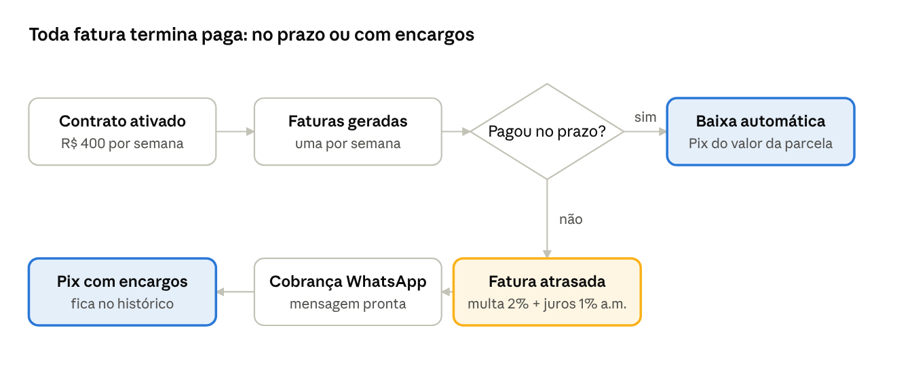

# Alu.GO Motos — Sistema de Faturas e Cobrança

Outubro de 2026

## Objetivo do sistema

O sistema transforma cada contrato de locação em faturas semanais automáticas, dá baixa sozinho quando o Pix cai e mostra na hora quem está em dia e quem está atrasado. O objetivo é a Alu.GO receber mais, no prazo, com menos trabalho manual.

Uma locadora de motos vive de pagamentos semanais: cada cliente paga uma parcela por semana enquanto usa a moto. Sem um sistema, isso vira planilha, conferência de extrato e cobrança feita de memória. O resultado costuma ser parcela esquecida, pagamento lançado errado e atraso que só aparece quando já virou prejuízo.

O sistema resolve três problemas:

- **Gerar as cobranças:** ao fechar um contrato (ex.: R$ 400 por semana durante 4 semanas), todas as faturas e vencimentos são criados automaticamente.
- **Registrar o pagamento:** quando o Pix é confirmado pelo banco ou gateway, a fatura é marcada como paga sozinha, com data e hora de Brasília, sem lançamento manual e sem risco de baixa duplicada.
- **Agir sobre o atraso:** fatura vencida aparece destacada, com dias em atraso, multa e juros já calculados e um botão para cobrar o cliente no WhatsApp.

## Para quem é

Três perfis da locadora usam a mesma tela, cada um com uma pergunta diferente:

| Perfil | Pergunta do dia a dia | O que o sistema entrega |
| --- | --- | --- |
| Financeiro | "O que entrou, o que falta entrar e o que está atrasado?" | Cards com A vencer, Em atraso (com multa e juros) e Recebido; cada pagamento separado em parcela, multa e juros |
| Atendimento e cobrança | "Quem eu preciso cobrar hoje e quanto?" | Lista de atrasadas com dias em atraso, valor atualizado e botão de cobrança no WhatsApp com a mensagem pronta |
| Gestão | "Quais clientes e motos estão em risco?" | Selo Inadimplente, filtros por cliente, placa e modelo, e o histórico "pago com N dias de atraso" |

## Funcionalidades

| Funcionalidade | O que faz | Exemplo |
| --- | --- | --- |
| Faturas automáticas | Ao ativar um contrato, o sistema cria todas as parcelas semanais com seus vencimentos | Contrato de R$ 400 × 4 semanas gera 4 faturas, uma por semana |
| Baixa automática do Pix | O gateway avisa que o Pix caiu e a fatura vira Paga sozinha, com data e hora de Brasília | Pix confirmado às 15:28 aparece como "Pago em 09/10, 15:28" |
| Proteção contra pagamento duplicado | Se o aviso do gateway chegar duas ou mais vezes, a baixa acontece uma vez só | Cinco avisos iguais ao mesmo tempo resultam em um único pagamento |
| Conferência do valor | Só dá baixa se o valor recebido for exatamente o devido; valor diferente é recusado e a fatura continua em aberto | Pix de R$ 390 numa fatura de R$ 400 é recusado |
| Multa e juros por atraso | Fatura vencida passa a cobrar multa de 2% + juros de 1% ao mês, proporcionais aos dias | R$ 400 com 14 dias de atraso = R$ 409,87 |
| Pagamento com encargos | A fatura atrasada é quitada pelo valor atualizado, e o sistema guarda separadamente parcela, multa e juros | "R$ 409,87 = R$ 400,00 + R$ 9,87 de encargos" |
| Cobrança no WhatsApp | Um botão abre o WhatsApp com a mensagem de cobrança pronta: nome, parcela, moto, placa, vencimento e valor atualizado | "Olá, Carlos! Consta em aberto a parcela 1/4…" |
| Selo Inadimplente e histórico | Fatura atrasada recebe o selo; depois de paga, o selo sai e fica "Pago com N dias de atraso" | "Pago com 14 dias de atraso" |
| Painel de resumo | Três cards: A vencer, Em atraso (com o total com multa e juros) e Recebido | Em atraso: R$ 4.220,00, ou R$ 4.319,12 com encargos |
| Filtros | Busca por cliente, por placa e por modelo de moto; abas Pendentes, Atrasadas e Pagas (a mais recente primeiro) | Placa "GHI" mostra só as faturas daquela moto |
| Formato Asaas | O mesmo endereço recebe avisos no formato do gateway Asaas, protegido por um token secreto | Pronto para ligar a um gateway real |

## Como funciona no dia a dia

A fatura paga no prazo é baixada sozinha quando o Pix cai. A atrasada passa a mostrar multa e juros, é cobrada pelo WhatsApp e, quando paga, fica registrada como "Pago com N dias de atraso".

## Valor para o negócio

O ganho principal é parar de perder dinheiro com atraso e lançamento manual. Na prática:

- **Menos inadimplência:** o atraso aparece no dia em que acontece, com o valor já atualizado e a cobrança a um clique. Quanto antes a cobrança, maior a chance de receber.
- **Multa e juros cobrados de verdade:** os encargos são calculados sozinhos e entram no valor da cobrança, em vez de serem esquecidos ou perdoados por falta de cálculo.
- **Fim da conferência manual de Pix:** a baixa é automática e o valor é conferido centavo a centavo. Ninguém precisa abrir extrato para saber se a parcela foi paga.
- **Dinheiro sem erro:** não existe baixa duplicada, pagamento pela metade marcado como pago nem fatura paga alterada depois. O financeiro confia no número que vê.
- **Decisão rápida sobre a frota:** o selo Inadimplente e o histórico de atrasos mostram quais clientes e motos estão em risco, por exemplo para avaliar o bloqueio da moto pelo rastreador.
- **Atendimento mais profissional:** a mensagem de cobrança sai padronizada e educada, com todos os dados corretos.

## Segurança e confiabilidade

As regras de dinheiro ficam no banco de dados, não na tela. Por isso valem para qualquer acesso, e não dá para contorná-las por fora do sistema.

- **Fatura paga não muda:** depois de paga, ela não pode ser cancelada, ter o valor alterado nem ser excluída.
- **Pagamento uma vez só:** avisos repetidos do gateway, mesmo chegando ao mesmo tempo, geram uma única baixa.
- **Valor conferido:** o valor aceito é o mesmo que a tela mostra, calculado por uma única fórmula de multa e juros.
- **Dados pessoais protegidos (LGPD):** a parte pública do sistema não consegue ler CPF, e-mail nem telefone dos clientes. A cobrança no WhatsApp funciona sem expor o telefone.
- **Gateway autenticado:** avisos no formato do Asaas só são aceitos com o token secreto combinado.
- **Testado:** 30 testes automáticos rodam contra um banco de dados real a cada alteração do código.

## Próximos passos sugeridos

A versão atual é uma demonstração completa do fluxo. Para uso real na Alu.GO, a ordem sugerida é:

1. **Login e perfis de acesso:** cada funcionário entra com usuário próprio, e o sistema registra quem fez o quê.
2. **Ligar ao gateway real (Asaas):** as cobranças Pix passam a ser emitidas pelo gateway, já com multa e juros configurados iguais aos do sistema, e os botões de simulação saem da tela.
3. **Cadastro pela tela:** clientes, motos e contratos criados direto no sistema, sem passar pelo banco de dados.
4. **Régua de cobrança automática:** lembrete antes do vencimento, aviso no dia e cobrança nos dias seguintes, enviados sozinhos por WhatsApp.
5. **Integração com o rastreador:** sugerir ou acionar o bloqueio da moto quando o atraso passar do limite definido pela locadora.
6. **Relatórios:** recebido por mês, inadimplência por período e histórico por cliente, para acompanhar a saúde do negócio.

## Como acessar e testar

O sistema está no ar em [aluware-mini-locacao.vercel.app](https://aluware-mini-locacao.vercel.app), com dados de demonstração: 7 clientes, 7 motos e 32 faturas. O código está em [github.com/lucasfranca46/aluware-mini-locacao](https://github.com/lucasfranca46/aluware-mini-locacao).

1. Clique em **Simular pagamento** numa fatura em dia: ela vira Paga na hora.
2. Faça o mesmo numa fatura atrasada: o valor já vem com multa e juros, e aparece "Pago com N dias de atraso".
3. Clique em **Reenviar webhook** numa fatura paga: o sistema responde que ela já estava paga e não duplica nada.
4. Clique no botão verde do **WhatsApp** numa fatura atrasada para ver a mensagem de cobrança.
5. Use os **filtros** por cliente, placa ou modelo.
6. Clique em **Resetar dados de teste** para voltar ao cenário inicial e testar de novo.
